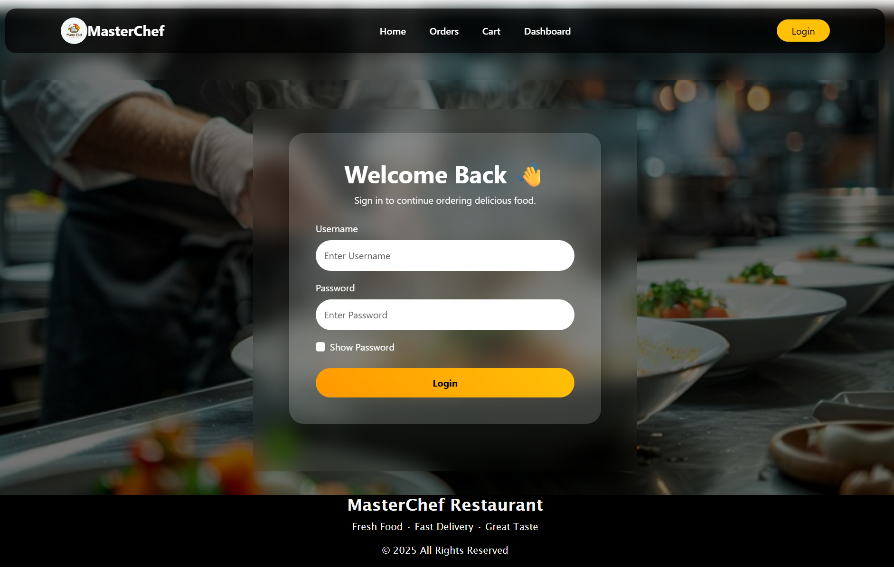
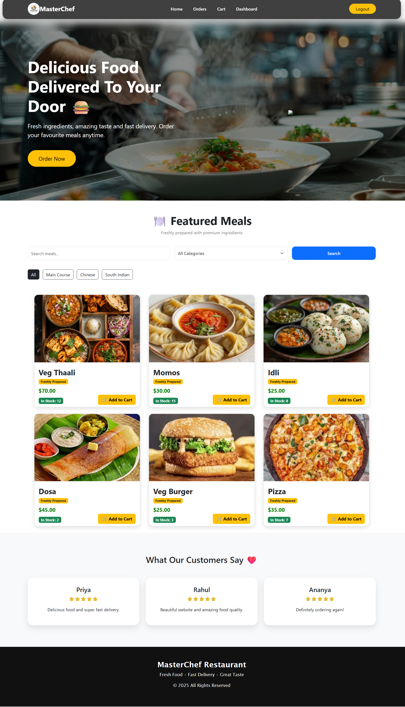
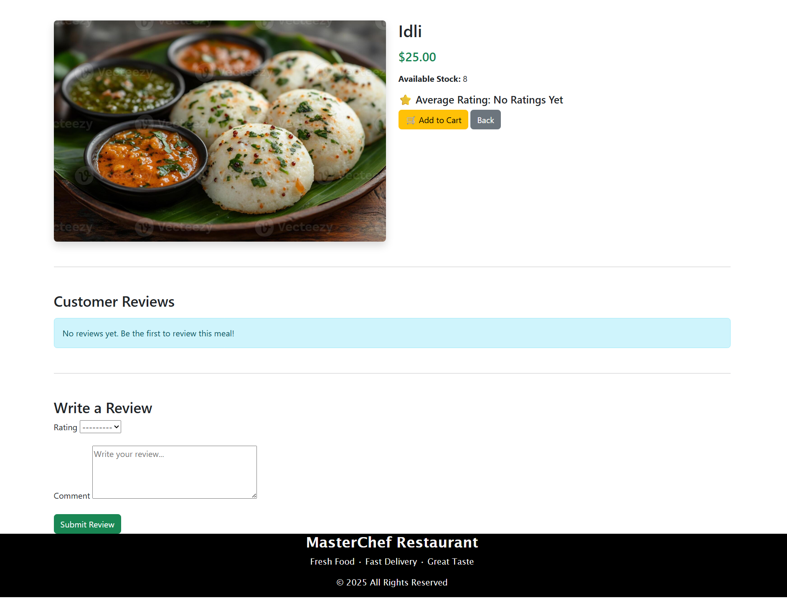
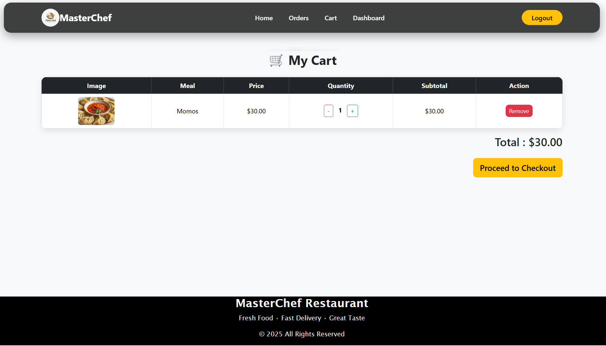
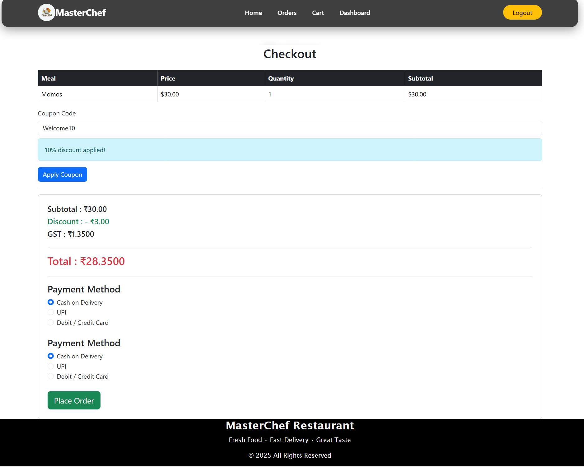
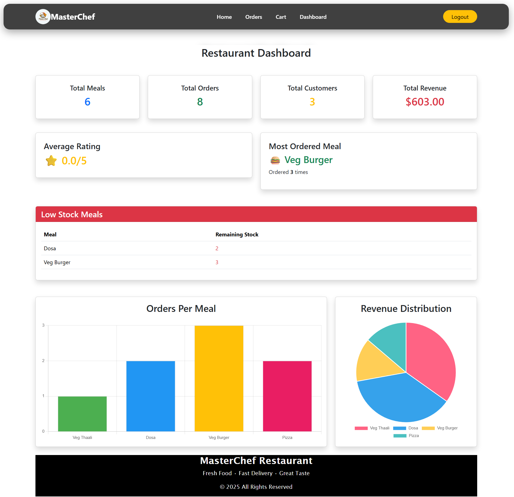
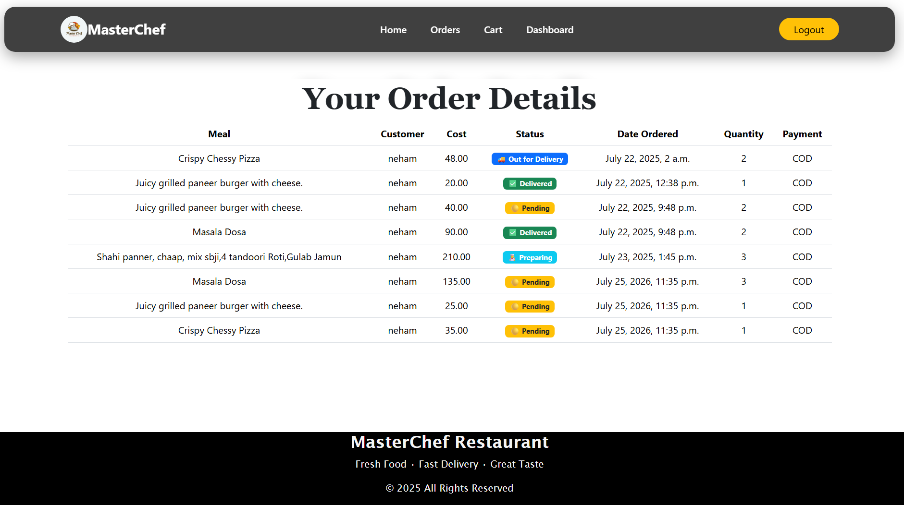
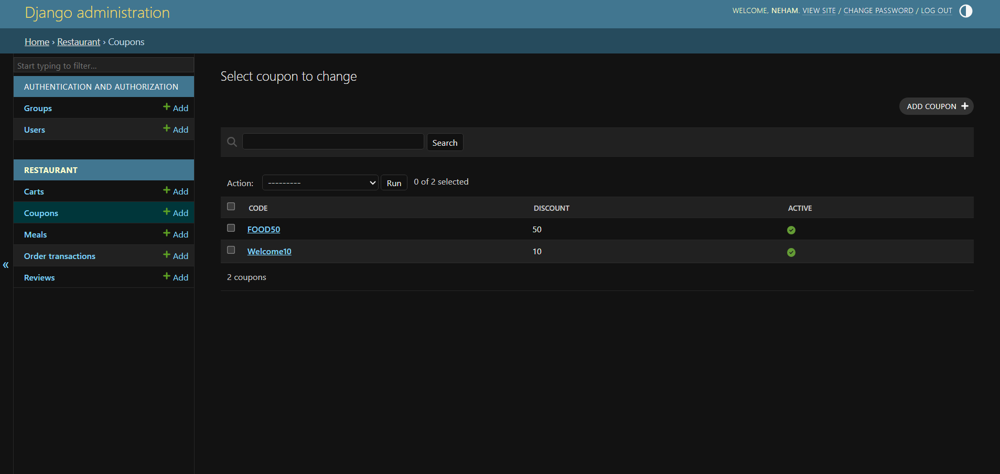

# 🍽️ Meta Brains Restaurant Management System

A full-stack Restaurant Management System built using Django that allows customers to browse meals, place orders, manage carts, apply coupons, leave reviews, and enables administrators to efficiently manage restaurant operations through an admin dashboard.

---

## 🚀 Live Demo

🔗 https://django-restaurant-system.onrender.com

---

## ✨ Features

### 👤 User Features

- User Registration & Secure Login
- Browse Restaurant Menu
- Meal Details Page
- Search Meals
- Filter Meals by Category
- Add Meals to Cart
- Increase/Decrease Cart Quantity
- Remove Items from Cart
- Checkout System
- Coupon Discount Support
- GST Calculation
- Order History
- Customer Reviews & Ratings
- Responsive UI for Desktop & Mobile

---

### 🔑 Admin Features

- Manage Meals
- Upload Meal Images
- Manage Categories
- Stock Management
- Manage Orders
- Customer Management
- Dashboard Analytics
- Revenue Tracking
- Most Ordered Meal
- Average Customer Rating
- Low Stock Monitoring

---

## 📊 Dashboard Analytics

The Admin Dashboard provides:

- Total Meals
- Total Orders
- Total Customers
- Total Revenue
- Average Ratings
- Most Ordered Meal
- Low Stock Alert
- Order Statistics Charts
- Revenue Distribution Chart

---

## 🛠 Tech Stack

### Backend

- Python
- Django 6
- MySQL (Development)
- PostgreSQL (Production)

### Frontend

- HTML5
- CSS3
- Bootstrap 5
- JavaScript

### Cloud Services

- Render (Deployment)
- Cloudinary (Media Storage)

### Other Libraries

- WhiteNoise
- Gunicorn
- Django Crispy Forms
- dj-database-url
- python-decouple

---

## 📁 Project Structure

```
Restaurant Management System
│
├── contact/
├── restaurant/
├── media/
├── static/
├── templates/
├── mysite/
├── manage.py
└── requirements.txt
```

---

## ⚙️ Installation

Clone the repository

```bash
git clone https://github.com/YOUR_USERNAME/YOUR_REPOSITORY.git
```

Move into the project

```bash
cd YOUR_REPOSITORY
```

Create virtual environment

```bash
python -m venv venv
```

Activate virtual environment

Windows

```bash
venv\Scripts\activate
```

Install dependencies

```bash
pip install -r requirements.txt
```

Create a `.env` file

```
SECRET_KEY=your_secret_key

DEBUG=True

DB_NAME=your_database

DB_USER=your_username

DB_PASS=your_password

DB_HOST=localhost

DB_PORT=3306

EMAIL_HOST_USER=your_email

EMAIL_HOST_PASSWORD=your_password
```

Apply migrations

```bash
python manage.py migrate
```

Create Superuser

```bash
python manage.py createsuperuser
```

Run Server

```bash
python manage.py runserver
```

---

## 🚀 Deployment

This project is deployed on **Render**.

Production services include:

- PostgreSQL Database
- Cloudinary Media Storage
- WhiteNoise Static Files
- Gunicorn WSGI Server

---

## 📸 Screenshots

Add screenshots of:









---

## Future Improvements

- Online Payment Gateway
- Email Order Confirmation
- Wishlist
- AI Meal Recommendation
- REST API
- Docker Support
- QR Code Ordering
- Multi Restaurant Support

---

## 👩‍💻 Author

Neha

GitHub:
https://github.com/NehaM2006/django-restaurant-pos-system

---

## 📄 License

This project is developed for learning and portfolio purposes.